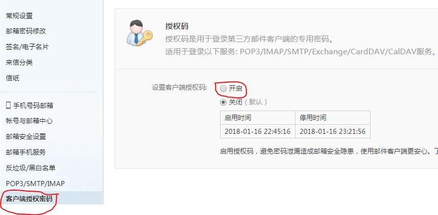

##12306火车订票

**一.使用环境：**

* **1.** Python3.6.1

* **2.** Chrome(版本为63)

**[注]：**启动chrome需要chromedriver的驱动，请根据Chrome版本下载相应版本的驱动
（在浏览器地址中输入chrome://version/可查看关于Chrome的一些信息。}

**二.使用方法：**

* **1.** 运行 `train_tickets.py` 文件前，请修改基本信息：您的12306登录时的用户名和密码，出发地，目的地，出发时间，所乘车次和乘车人信息。
* **2.** 请手动点击图片验证码

**邮箱配置说明：**

- 发送邮件的邮箱有很多，在本测试中，使用的是163.com的邮箱作为发信人邮箱，并且使用SMTP协议发送邮件。
- 首先需要在邮箱设置中开启SMTP协议，如下图所示：

- 发送邮件成功的前提是已经开通客户端授权,开通后会让你设置密码,那个密码就是下面的passwd接收的授权密码。否则会出现下面的错误提示： 

	raise SMTPAuthenticationError(code, resp)
	smtplib.SMTPAuthenticationError:（535, b'Error:authentication failed'）

- 一般情况下第一次都是可以发送成功的，但是有的情况下，可能会被当做垃圾邮件处理，这个就需要用户对邮箱自行进行设置。